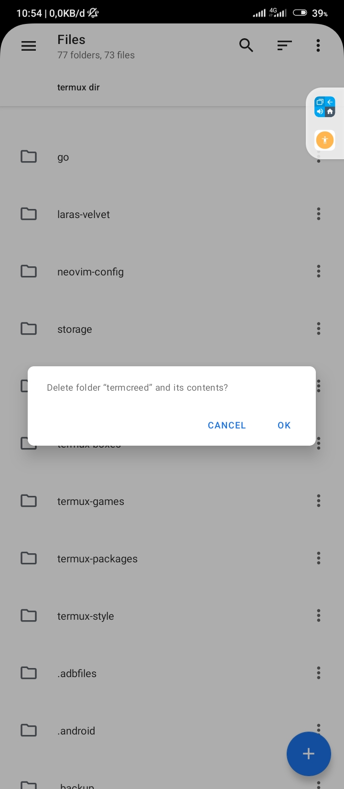

# termcreed
A Script for termux-login.sh usage
<a href="https://asciinema.org/a/UZPoC6PqFApLTadT1aO8n7ek6" target="_blank"></a>


# Prerequisites

A <a href="https://www.nerdfonts.com">Nerd Font</a> is installed and enabled in your terminal.

# Deps.

* age
* ncurses
* boxes

# Setup

Freely edit this parts.

```sh
# Your Information login
username_valid="$(cat ~/.ssh/userid)";
password_valid="$(age -d -i ~/.ssh/keyid.txt ~/.ssh/passid)" # Encrypted password stored at ~/.ssh/passid or your options
```

# Usage

Backup first your termux-login.sh

```sh

echo '
[ -z "$BASH_VERSION" ] && exec bash "$0" "$@"
trap '' SIGINT #SIGTSTP

source ~/termcreed/*.sh ' > $PREFIX/etc/termux-login.sh
```
## Support shells
* bash
* mksh
* zsh
* fish (slowest, not recomended)
  
## forgot password?



# License
MIT
